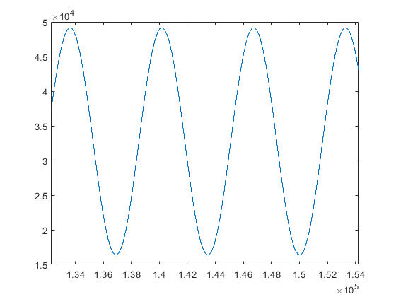
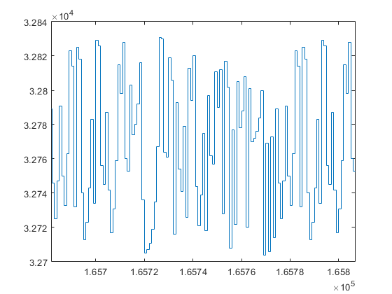
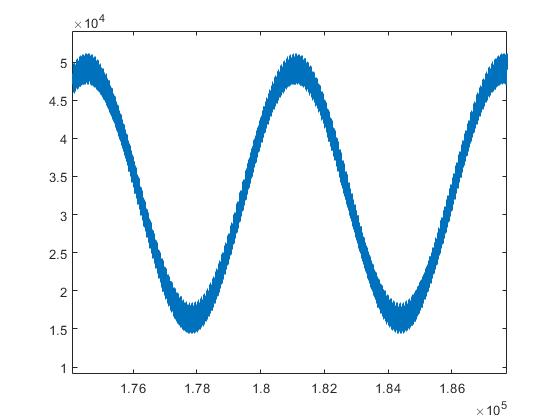
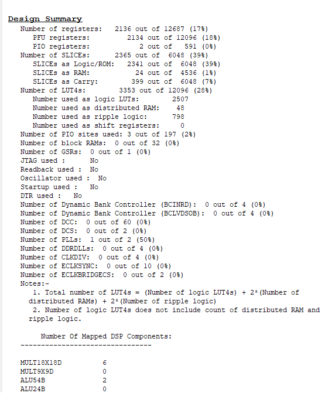
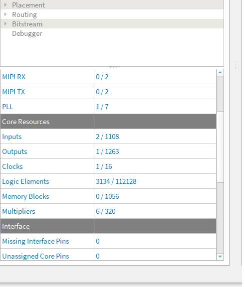
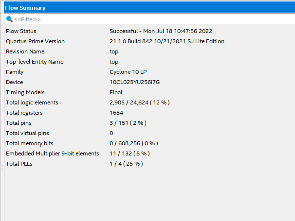
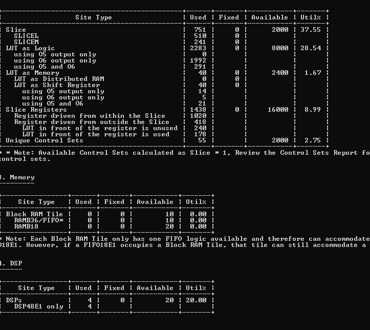

example project of high level vhdl
==================================

There is an example project that includes build scripts for building the project using Efinix Efinity, Lattice Diamond, Intel Quartus and Xilinx Vivado. The example project is tested with FPGA. The build scripts allow a single command to build the project with any of the tools.

The example project uses uart, multiplier, floating point math and the internal bus. The design creates a noisy sine wave and a fixed and a floating point filters to clean the noise from the the sine. The sine, noise, and fixed and floating point filtered versions of the noisy sine are then connected to an internal bus. The bus is connected to an uart which allows communication between the FPGA and a PC. The communication allows streaming the register pointed by a number that is obtained from the UART, thus any register connected to the bus is readable from the uart with a PC.

See the example here :
https://github.com/hVHDL/hVHDL_example_project

Example Project
---------------

The project top module is called 'top'. Intel, Lattice and Xilinx tools use similar top files that instantiate the main clocks and connects signals from project into the physical IO signals in the top file. With Efinix tools the PLL is managed by the build system, thus Efinix tools manage this PLL layer of the design. The efinix_top.vhd file is common for all builds which reduces the need to manage multiple different versions of the project main IO routing layer.

.. literalinclude:: vhdl_sources/ecp5_top.vhd
   :caption: Diamond, Quartus and Vivado top file
   :language: vhdl

The efinix top module instantiates the main system interconnect module which instantiates the main design modules and connects them together . The first interesting design feature is visible in the IO names of the routed uart IO signal. The reason for the long names of the uart sources is that the IO are routed through the design using records. The use of records allows syntax checking to catch signal routing bugs in the design. If we change a module with IO, then the syntax checking will see that the name of the module is changed and flags an error if we did not remember to change the signals accordingly.

.. literalinclude:: vhdl_sources/efinix_top.vhd
   :caption: Efinix top
   :language: vhdl

Noisy sine generation
---------------------

The High level coding patterns are visible in the sine generation. The process that creates a sine, noise and 100kHz time level for the signal and filtering is shown below. In the process we create a multiplier, a sincos module that calculates both sine and cosine of an angle and initialize the internal bus node as well as the fixed and floating point filter modules. The full source code can be found here https://github.com/hVHDL/hVHDL_example_project/blob/main/source/hvhdl_example_interconnect/hvhdl_example_interconnect_pkg.vhd

The process creates as down counter, that counts from 1199 to zero. This corresponds to 100kHz time level at 120MHz system clock. When the counter is zero, the sine calculation is requested and both noise and angle are updated. When sine calculation is ready as indicated by the sincos_is_ready function call returning true, the fixed and floating point filters are requested.

.. literalinclude:: vhdl_sources/sine_and_time_level_generation.vhd
   :caption: sine and timelevel generation
   :language: vhdl

Sine, noise, angle and noisy sine are all connected to the internal bus. This is done with a procedure call to connect_read_only_data_to_address. The arguments are the in and out directional bus, address to which the data is readable from and then the data which is connected to the bus. The bus is made to be 16 bit wide, making that the numbers are between 0 and 65535, thus 32768 is added to the signals in order to fit negative numbers into the 16 bit number range.

Filter interface
----------------

The filters have a common entity. Since both the fixed and floating point filter take in the noisy sine and then connect the filtered sine into the internal bus, we use a common source file for both. The example_filter_entity.vhd has a package that defines a record and two interface subroutines. These subroutines are init_filter_example and request_filter_example, which allows an abstract interface to the module. With the use of this record, the module which uses the filter does not need to have accurate description on how the filterin is actually used. This allows also changing the interface if this is needed.

.. literalinclude:: vhdl_sources/filter_interface.vhd
   :caption: filter interface functions and entity description
   :language: vhdl

Floating point filter implementation
------------------------------------

The actual filter implementation is in the two alternate architectures of the filter interface. Since the noisy sine is calculated using fixed point, the floating point filter first transforms the integer to floating point number, then filters the signal and then transforms the result back to fixed point and lastly connects the result to the internal bus.

The floating point module is accessed with call to the create_float_alu, create_denormalizer and create normalizer procedures with assciated signals as arguments. The float alu implements floating point add and subtract functions and a floating point multiplier. The created normalizer and denormalizer are used for transforming between integer and floating point numbers. The actual filter calculation calculates a first order filter using y <= y + (u-y) * filter_gain.

.. literalinclude:: vhdl_sources/floating_point_filter.vhd
   :caption: floating point filter implementation
   :language: vhdl

Fixed point filter implementation
------------------------------------

The fixed point filter is similarly implemented in its own architecture. The fixed point filter process similarly to the floating point implementation creates a fixed point filter. The filter needs a multiplier and the actual filter record type signal. The create_first_order_filter procedure call creates the state machines that are needed for the fixed point filter calculation. The implementation of the fixed point filter can be found in the math library https://github.com/hVHDL/hVHDL_math_library/blob/main/first_order_filter/first_order_filter_pkg.vhd

The fixed point filter uses a slightly different implementation of the filter than the floating point one, but resulting response is the same.

.. literalinclude:: vhdl_sources/fixed_point_filter.vhd
   :caption: fixed point filter implementation
   :language: vhdl

Filtering results
-----------------

The signals are captured using uart and plotted into figures with matlab. The original sine, noise and combined noisy sine are shown below

Since the fixed and floating point implmentations of the filters have the same response, the filtering results are also almost identical.

.. image:: figures/filtered_sine.png

Synthesis results
-----------------

The synthesis results are shown in figure below the ecp, efinix and intel resource use including both luts and multipliers are quite similar due to 4 input lookup tables. Spartan 7 has six input luts and the compiler manages to use a lot of the 6 input luts, thus the resource use is somewhat smaller. All of the designs meet timing at 120MHz.

