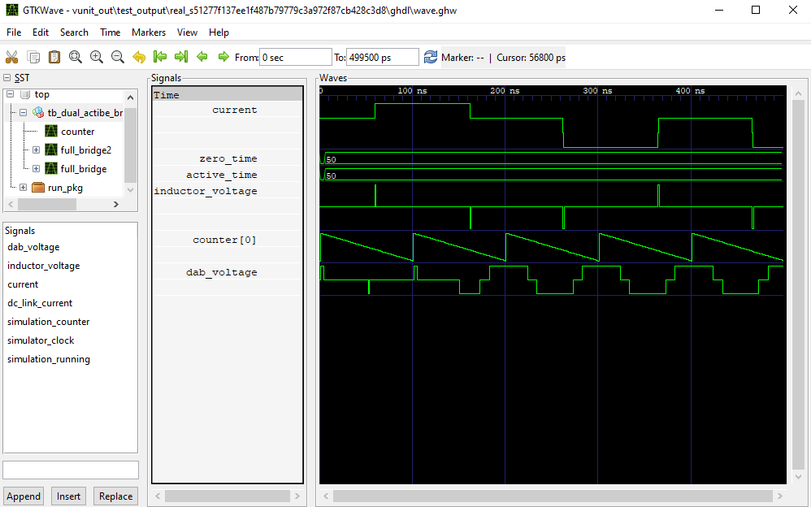

example of a high level vhdl use
================================

There is an example project that includes build scripts for building the project using Efinix Efinity, Lattice Diamond, Intel Quartus and Xilinx Vivado.

The project can be used as an example how to include and use hVHDL sources to your own project. The project uses uart, multiplier, sine, interconnecting bus, a floating point math and memory.

see example here :
https://github.com/hVHDL/hVHDL_example_project

Project
-------
The example project uses uart, multiplier and the internal bus. The design creates a sine wave, a noise using a pseudorandom binary sequence generator sums these two together and connect the signals into the internal bus.

The bus master has an uart which allows communication between the FPGA and a PC. The communications which allows streaming the register pointed by a number that is obtained from the UART, thus any register connected to the bus is readable from the uart.

.. literalinclude:: vhdl_sources/ecp5_top.vhd
   :caption: Diamond, Quartus and Vivado top file
   :language: vhdl

The efinix_top.vhd file is common for all builds. The reason for the long names of the uart sources is that the IO are routed through the design using records. The use of records allows syntax checking to catch bugs in the design. Thus if we change a module, then the syntax checking will see that the name of the module is changed and flags an error.

.. literalinclude:: vhdl_sources/efinix_top.vhd
   :caption: Efinix top
   :language: vhdl

