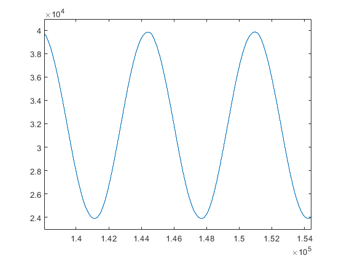

example project of high level vhdl
==================================

There is an example project that includes build scripts for building the project using Efinix Efinity, Lattice Diamond, Intel Quartus and Xilinx Vivado. The example project is tested with FPGA. The build scripts allow a single command to build the project with any of the tools.

The example project uses uart, multiplier, floating point math and the internal bus. The design creates a noisy sine wave and a fixed and a floating point filters to clean the noise from the the sine. The sine, noise, and fixed and floating point filtered versions of the noisy sine are then connected to an internal bus. The bus is connected to an uart which allows communication between the FPGA and a PC. The communication allows streaming the register pointed by a number that is obtained from the UART, thus any register connected to the bus is readable from the uart with a PC.

See the example here :
https://github.com/hVHDL/hVHDL_example_project

Example Project
---------------

The project top module is called 'top'. Intel, Lattice and Xilinx tools use similar top files that instantiate the main clocks and connects signals from project into the physical IO signals in the top file. With Efinix tools the PLL is managed by the build system, thus Efinix tools manage this PLL layer of the design. The efinix_top.vhd file is common for all builds which reduces the need to manage multiple different versions of the project main IO routing layer.

.. literalinclude:: vhdl_sources/ecp5_top.vhd
   :caption: Diamond, Quartus and Vivado top file
   :language: vhdl

The efinix top module instantiates the main system interconnect module which instantiates the main design modules and connects them together . The first interesting design feature is visible in the IO names of the routed uart IO signal. The reason for the long names of the uart sources is that the IO are routed through the design using records. The use of records allows syntax checking to catch signal routing bugs in the design. If we change a module with IO, then the syntax checking will see that the name of the module is changed and flags an error if we did not remember to change the signals accordingly.

.. literalinclude:: vhdl_sources/efinix_top.vhd
   :caption: Efinix top
   :language: vhdl

.. image:: figures/noise.png

.. image:: figures/noisy_sine.png

