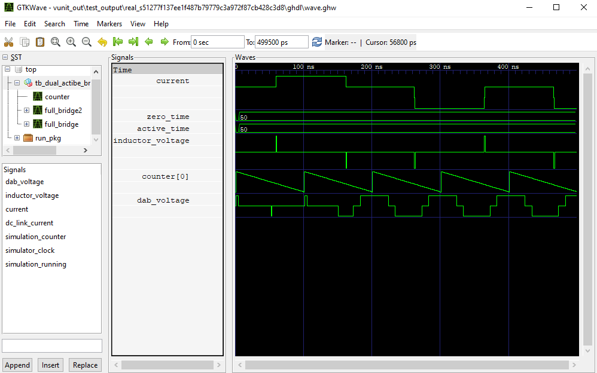

.. _interfaces:

Create High Level Interfaces in VHDL
====================================

The interfaces are designed to greatly increase abstraction level of VHDL source code.
The key idea behind the patterns are 1) all code should be shareable 2) all code should be changeable when needed.
To accomplish these two almost opposite ideas we have designed specific patterns for coding 
- all functionality should be behind abstract interfaces
- all code modules should have the possibility to exert backpressure - there should be no need to time code
- Use any IP from any vendor, add abstract interface if not already given by vendor 

The main property of an interface is to create a well defined methods for accessing some functionality. The reason for having this interface is that the code behind the interface is indirectly used. This allows the code to be changed and modified without the changes being propagated to the application. This also allows sharing code accross multiple projects.

We can create an interface to either an IP component, that is an entity with a port as well as a set of functionality by using record as a minimal entity that is then used inside a process. 

In VHDL records define the abstract data types and functions and procedures then define the way these data types are interacted with.

Records as abstract data types in VHDL
--------------------------------------

The main abstract data type in VHDL is called a record. Records are aggregates of any other types. Thus they can be made from anything you can make a signal from. This includes all types like arrays of records.

.. literalinclude:: ../vhdl_sources/multiplier_example_pkg.vhd
   :caption: example of a VHDL object record where all registers needed for a functionality are in one record
   :language: vhdl
   
This record object is then added to a project by simply adding a signal of this record type. Since the entire functionality of a multiplier is encapsulated in this one signal of record type, we only need to instantiate a signal of this multiplier_record type.

Subroutines
-----------

The magic happens when we use inout as the access type to the signal that is input to the module. With the inout declaration, we can put any multi cycle logic into a record.

.. literalinclude:: ../vhdl_sources/multiplier_subroutine_example_pkg.vhd
   :caption: example of a VHDL subroutine interface
   :language: vhdl
   

Using a simple interface
------------------------

The way we use these high level objects is through the subroutine interface. These interfaces are used with the signal of object record type as the argument. This way all of the specifics of the code remain in one place and therefore any changes in the code are also propagated to everywhere the code is used. Because of this we can modify code inside the abstracted interface and changes are propagated everywhere the code is being used.

